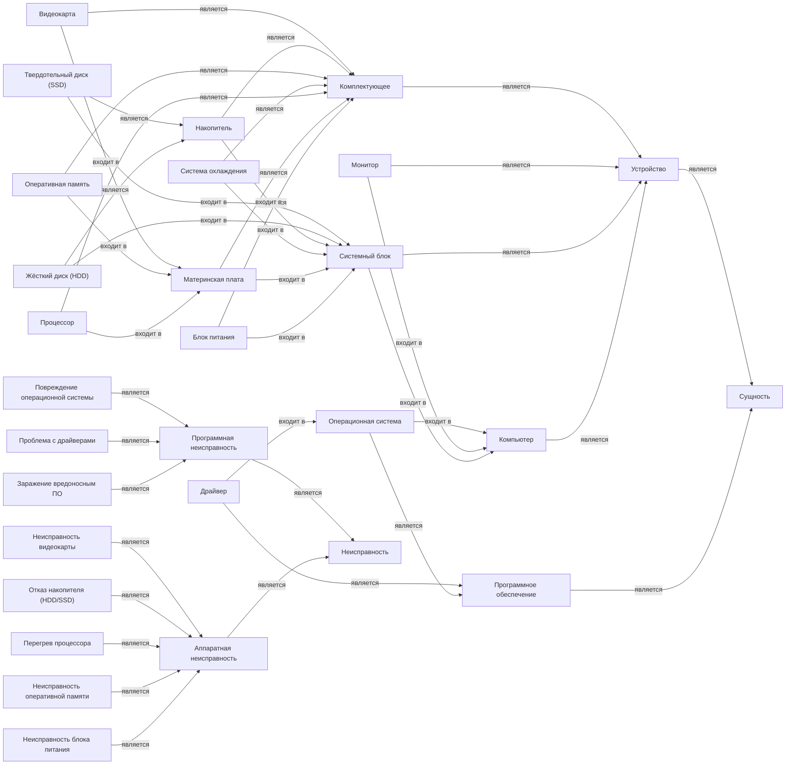

# Семантическая сеть (фрагмент: иерархия компонентов)

```mermaid
graph LR
    system_unit["Системный блок"]
    storage["Накопитель"]
    ssd["Твердотельный диск (SSD)"]
    software_fault["Программная неисправность"]
    software["Программное обеспечение"]
    ram_failure["Неисправность оперативной памяти"]
    ram["Оперативная память"]
    psu_failure["Неисправность блока питания"]
    psu["Блок питания"]
    overheating["Перегрев процессора"]
    os_corruption["Повреждение операционной системы"]
    os["Операционная система"]
    motherboard["Материнская плата"]
    monitor["Монитор"]
    malware["Заражение вредоносным ПО"]
    hdd["Жёсткий диск (HDD)"]
    hardware_fault["Аппаратная неисправность"]
    hardware_component["Комплектующее"]
    gpu_failure["Неисправность видеокарты"]
    gpu["Видеокарта"]
    fault["Неисправность"]
    entity["Сущность"]
    driver_issue["Проблема с драйверами"]
    driver["Драйвер"]
    disk_failure["Отказ накопителя (HDD/SSD)"]
    device["Устройство"]
    cpu["Процессор"]
    cooler["Система охлаждения"]
    computer["Компьютер"]
    computer -->|является| device
    system_unit -->|является| device
    system_unit -->|входит в| computer
    monitor -->|является| device
    monitor -->|входит в| computer
    psu -->|является| hardware_component
    psu -->|входит в| system_unit
    motherboard -->|является| hardware_component
    motherboard -->|входит в| system_unit
    cpu -->|является| hardware_component
    cpu -->|входит в| motherboard
    cooler -->|является| hardware_component
    cooler -->|входит в| system_unit
    ram -->|является| hardware_component
    ram -->|входит в| motherboard
    storage -->|является| hardware_component
    storage -->|входит в| system_unit
    hdd -->|является| storage
    hdd -->|входит в| system_unit
    ssd -->|является| storage
    ssd -->|входит в| system_unit
    gpu -->|является| hardware_component
    gpu -->|входит в| motherboard
    os -->|является| software
    os -->|входит в| computer
    driver -->|является| software
    driver -->|входит в| os
    hardware_component -->|является| device
    software -->|является| entity
    device -->|является| entity
    hardware_fault -->|является| fault
    software_fault -->|является| fault
    psu_failure -->|является| hardware_fault
    ram_failure -->|является| hardware_fault
    overheating -->|является| hardware_fault
    disk_failure -->|является| hardware_fault
    gpu_failure -->|является| hardware_fault
    malware -->|является| software_fault
    driver_issue -->|является| software_fault
    os_corruption -->|является| software_fault
```
